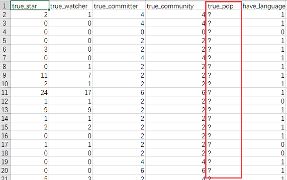
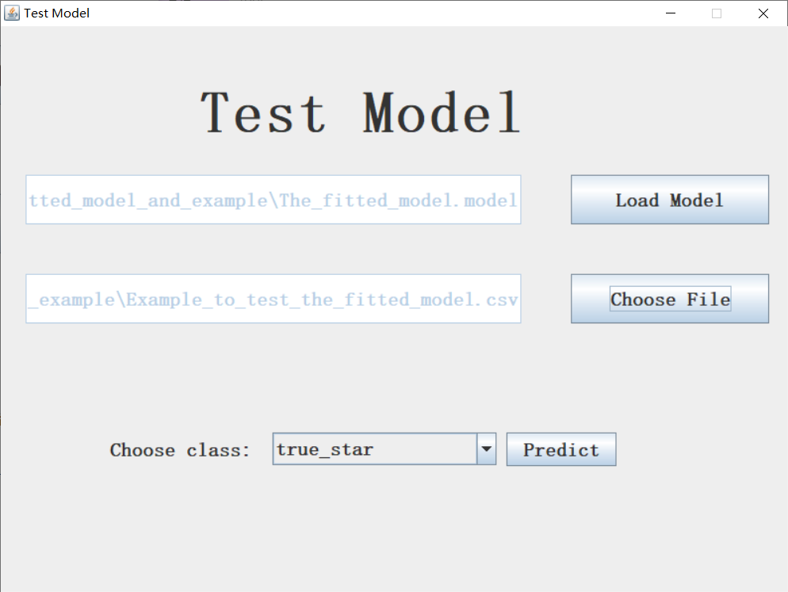
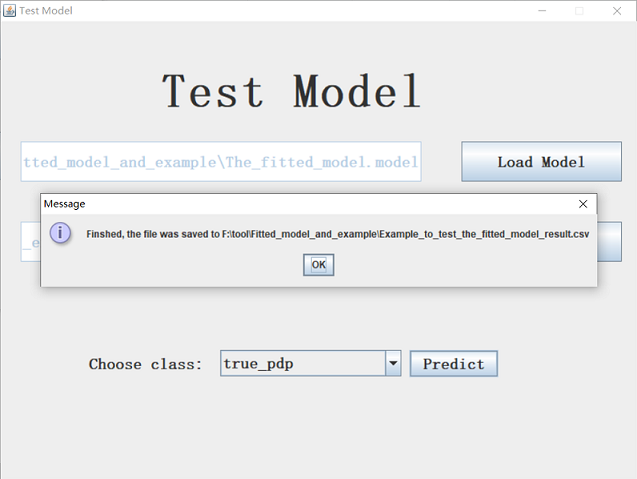
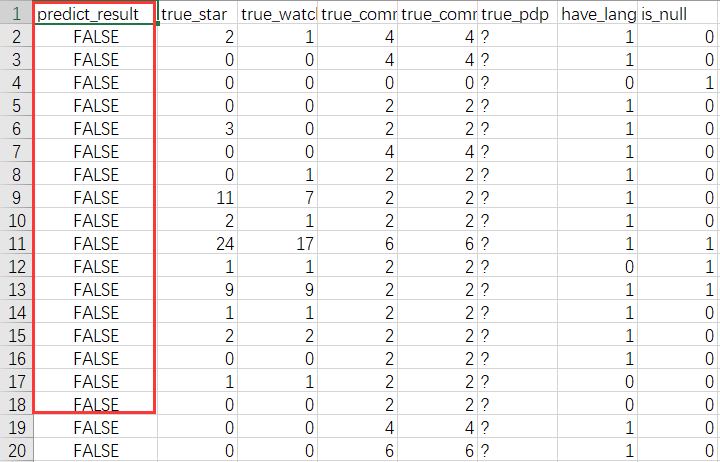
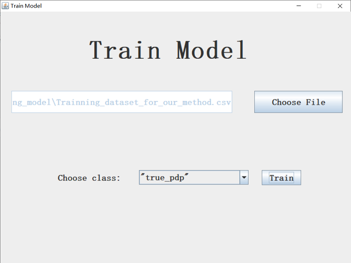

# NASAC Supplementary Material

This repository contains the resources and the tool mentioned in our paper: An Improved Method for Automatic Detection of Public Development OSS Projects. 

With this simple visual tool, researchers can easily use our model to detect public development projects. Besides, researchers can also use this tool to train their own J48 model.

## Structures

In this repository, we provide seven folders.

1. **compare_different_models**: This is a folder that contains the datasets used in Section VII.
2. **Data_collection**: This folder contains the datasets used in Section VII.
3. **stability_test_for_different_methods**: This is a folder that contains the datasets used in Section VII.
4. **tool**: This folder contains the simple visual tool of our experiment. This tool is in the form of .exe. So you can use it on the Windows platform.
5. **Fitted_model_and_example**: This folder contains the fitted model used in Section VII.B.
6. **result_of_the_base_line**: This folder contains the results of the base line method using different parameters.
7. **Snapshots**: This folder contains the snapshots used in *README.md*.

## How to Use our tool?

### 1. Use Our Model Directly.

For researchers who aim to study public development projects and agree to our defination of public development projects, they can directly use our model to detect public development projects from the candidate samples.

There are two points that researchers should pay attention to.

1. These candidate samples need to add **basic information**, **keyword information** (whether the sample contains a keyword) and **URL information**. Users can refer to the specific format of our test datasets in folder Datasets).

2. The file should be in form of **.csv**.

Researchers can use our tool with the following steps: 

1. Click the *Test Model* button and you can see this interface. 

2. Click the *Load Model* button and choose the model file provided by us in the *model folder*.

3. Click the *Choose File* button and choose your test file (Attention! The file should be in the form of .csv and should contains the *class attribute*). Like this:

4. Choose the class attribute (defalut: true_pdp) and click the *Predict* button. Then you can get the result.

5. Now we can find the file and see the results. The first column is the predicted results.

### 2. Adjust Our Model According to Researchers’ Needs. 

For researchers who aim to study public development projects but don’t agree to our labeling standards, they should find the parts they disagree with, then relabel our training dataset and fit the model on the updated training dataset. 

There are also some points that researchers should pay attention to:

1. The training file should be in form of **.csv**.

2. Since our tool is based on **J48 model**, you can only get the J48 model with your own training set.

Researchers can use our tool with the following steps: 

1. Open the tool folder, and run the **Tool.exe**. Then you can see this interface.

2. Click the *Train Model* button and you can see this interface. Then you can follow these steps to train your own model.

3. Click the *Choose File* button and choose your own training file (you can update the defalut training data we proposed in Datasets/test_datasets/balanced_training_set.csv). (Please choose the **.csv file** as training file!)

4. Select your *class attribute* and click the *Train* button. Then you can get the .model file.

5. Now we can find the .model file and use Weka to see what the J48 decision tree looks like.

